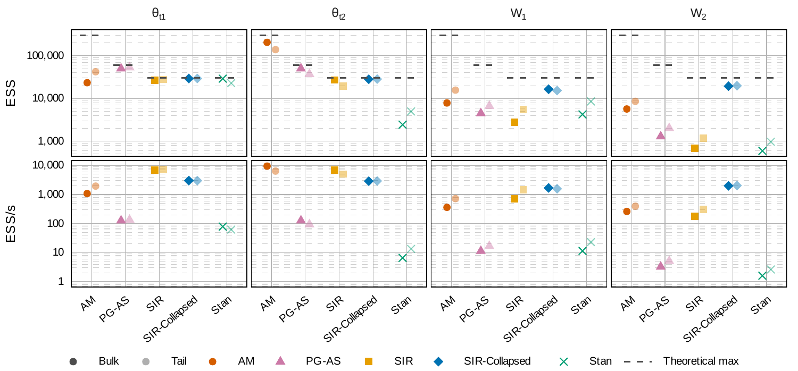

# Poisson Local Trend Dynamic Model

Code, data, and instructions to reproduce the simulation study and real-data
application of **"Efficient Samplers for the Poisson Local Trend Dynamic
Model"**, submitted to the VIII Latin American Meeting on Bayesian Statistics
(VIII COBAL) / XVIII Brazilian Meeting of Bayesian Statistics (EBEB), 2027.

**Authors**: 
* Cleiton Moya de Almeida (PIPGEs UFSCar/USP)
* Michel Helcias Montoril (UFSCar)



## Overview

The **Poisson Local Trend Dynamic Model (PoissonLTDM)** is a second-order
polynomial Dynamic Generalized Linear Model with Poisson observations. The
state vector $(\theta_{t1}, \theta_{t2})$ has $\theta_{t1}$ as the level
(log-intensity, entering the observation equation via $\exp(\theta_{t1})$)
and $\theta_{t2}$ as the slope, following the Durbin & Koopman / Harvey
structural-time-series nomenclature.

The paper compares five Bayesian samplers for this model:

| Method            | Description                                                           |
|-------------------|-----------------------------------------------------------------------|
| `amh_montoril`    | Adaptive Metropolis-Hastings (componentwise, Robbins–Monro tuning)    |
| `pg_as`           | Particle Gibbs with Auxiliary Particle Filter / Ancestor Sampling     |
| `sir_laplace`     | Sampling-Importance-Resampling with Laplace/IRLS approximation        |
| `sir_collapsed`   | **Main methodological contribution**: Collapsed version of SIR/Laplace|
| `stan`            | HMC/NUTS via Stan — reference / gold-standard sampler                 |

Two applications are reported:

1. A **simulation study** across a grid of series lengths and function types
   (steps, piecewise linear, piecewise quadratic, sinusoidal),
   comparing sampler efficiency and estimation accuracy.
2. A **real-data application** to the `campy` dataset (28-days period campylobacteriosis
   counts, Quebec, 1990–2000; from the `tscount` package), benchmarked against
   two observation-driven models fit with `tscount::tsglm()` and evaluated via
   one-step-ahead predictive log-likelihood.

## Repository structure

```
cobalebeb2027/
├── PoissonLTDM/                  # R package (Rcpp) — the samplers
│   ├── R/                        # metrics.R, sampler_stan.R, RcppExports.R
│   ├── src/                      # utils.h + one .cpp per sampler + RcppExports.cpp
│   │                              # (*.o/*.so are build artifacts, gitignored —
│   │                              #  pkgload::load_all() recompiles them locally)
│   └── inst/stan/                # poisson_ltdm.stan
│
├── R_prototypes/                 # Didactic, pure-R reference implementations
│                                  # (pg_as_r(), amh_montoril_r(), sir_laplace_r(),
│                                  #  sir_collapsed_r() — signatures mirror the *_cpp() ones)
│
├── tests/                        # Correctness / validation harness
│   ├── test_prototype_R.R        # Single sampler, R prototype
│   ├── test_cpp.R                # Single sampler, Rcpp port (sequential or parallel chains)
│   ├── test_R_vs_cpp.R           # R prototype vs Rcpp port, numeric agreement
│   ├── test_stan.R               # Stan (NUTS) sampler
│   └── plot_diagnostics.R        # Shared diagnostics/plotting helper
│
├── data/
│   ├── data_generation.R         # Generates the synthetic series used by both
│   │                              # calibration and the production simulation
│   └── simulated/                # <function>_<Tt>_<replica>.rds files
│
├── calibration/                  # Tuning phase (N / burnin / K per method)
│   ├── calibration_run.R
│   ├── calibration_aggregate.R
│   ├── calibration_aggregate.pbs
│   ├── calibration_pbs.tmpl
│   └── check_calibration_progress.R
│
├── simulation/                   # Production simulation study
│   ├── simulation_run.R
│   ├── simulation_grid_config.R  # run_mode / grid_subset — edit without touching simulation_run.R
│   ├── simulation_aggregate.R    # summary_replicas/by_t/aggregated.csv (pointwise coverage
│   │                              # is a column of summary_by_t.csv, not a separate file)
│   ├── simulation_pbs.tmpl
│   └── check_simulation_progress.R
│
├── results/                      # batchtools/cluster subfolders are gitignored
│   │                              # (results/simulation/partial/, results/application/chains/,
│   │                              #  results/calibration/*.rds) — everything else is versioned
│   ├── calibration/               # summary.csv + plots/ versioned; per-config .rds gitignored
│   ├── simulation/                # summary_*.csv versioned; partial/ (per-task .rds) gitignored
│   └── application/               # summaries + benchmark CSVs versioned; chains/ gitignored
│
├── application/                  # Real-data application (`campy`)
│   ├── real_data_run.R           # Fits all five samplers to `campy` (+ aggregation)
│   ├── real_data_pbs.sh          # PBS wrapper for real_data_run.R
│   ├── real_data_aggregate.R     # Optional: re-aggregate existing checkpoints
│   ├── predictive_loglik_pf.R    # Predictive log-likelihood via particle filter
│   ├── predictive_loglik_pf_pbs.sh
│   ├── tscount_literature_benchmark.R      # INGARCH/log-linear Poisson benchmarks
│   └── tscount_literature_benchmark_pbs.sh
│
├── paper_plots/
│   ├── figures_simulation.R      # Simulation-study figures
│   ├── figures_real_data.R       # article_real_data_fit.pdf, article_real_data_ess.pdf,
│   │                              # + console-printed results tables (no LaTeX output)
│   └── plots/                    # Rendered PDFs
│
└── cache/                        # Compiled Stan model cache (not versioned)
```

## The `PoissonLTDM` package

`PoissonLTDM` is the R/Rcpp package containing the production implementation
of all five samplers. Performance-critical inner loops (`amh_montoril`,
`pg_apf`/`pg_as`, `sir_laplace`, `sir_collapsed`) are implemented in C++
(`src/`), sharing common routines through `utils.h`. `sampler_stan.R` wraps
the Stan/`rstan` model in `inst/stan/poisson_ltdm.stan`.

Install locally with:

```r
# from the repository root
pkgload::load_all("PoissonLTDM")   # for development / interactive use
# or
devtools::install("PoissonLTDM")    # for a regular package install
```

The package's own runtime dependencies (per `PoissonLTDM/DESCRIPTION`) are
`Matrix`, `HDInterval`, `rstan`, `Rcpp` (`Imports`) and `Rcpp`,
`RcppArmadillo` (`LinkingTo`). `convergence.cpp` (the `rhat_ess_fast()`
implementation) additionally needs **FFTW3** and **OpenMP** at the system
level — see [Requirements](#requirements) below; the other four `.cpp`
files need neither.

### `R_prototypes/`

Standalone, pure-R implementations of the same four non-Stan samplers
(`pg_as_r()`, `amh_montoril_r()`, `sir_laplace_r()`, `sir_collapsed_r()`),
kept outside the package. Their purpose is **didactic**: each function's
signature and return structure mirror the corresponding `PoissonLTDM::*_cpp()`
routine one-to-one, so a reader can follow the algorithm in plain R before
looking at the optimized C++ code. They also serve as the reference
implementation against which the C++ port is validated (see below).

## Tests and validation

The `tests/` directory is the correctness harness, not an automated
`testthat` suite bundled with the package — it is meant to be run manually.

- **`test_prototype_R.R`** / **`test_cpp.R`** / **`test_stan.R`** — run a
  single sampler (`method`/`f`/`Tt`/`replica` set inline near the top of
  each file) on one simulated dataset, with all hyperparameters and initial
  values exposed inline in the script (no shared config layer).
  `test_cpp.R` and `test_stan.R` run `N_chains` dispersed-initialization
  chains (`test_cpp.R` sequentially or in parallel, via `parallel_chains`;
  `test_stan.R` via `rstan::sampling()`'s own `chains=`/`cores=`).
  Diagnostics and plots are produced by the shared `plot_diagnostics.R`
  helper (`print_and_plot_diagnostics()`), which adapts automatically to
  the fields returned by each algorithm (SMC-ESS, MH acceptance rate,
  IS-ESS, CE-calibration diagnostics, multi-chain R-hat/ESS, etc.).
- **`test_R_vs_cpp.R`** — runs the R prototype and the C++ port with the
  same seed and configuration and compares every output field with
  `testthat::expect_equal(tolerance = 1e-10)`. This is the check that the
  Rcpp port is numerically faithful to the didactic R implementation.
- **`test_rhat_ess_fast.R`** — validates `PoissonLTDM::rhat_ess_fast()`
  (the C++/FFTW3/OpenMP reimplementation of multi-chain R-hat/bulk-ESS/
  tail-ESS) against `posterior::rhat()`/`ess_bulk()`/`ess_tail()`, and
  benchmarks its speed at production scale.

All four single-sampler/multi-chain scripts (`test_prototype_R.R`,
`test_cpp.R`, `test_stan.R`) compute their random seed with the same
formula `simulation_run.R` uses for its production task grid — running one
of them for a given `(method, f, Tt, replica)` reproduces the exact seed
of that combination's production chain 1 (see the comment above each
script's seed computation for the formula, and for how to instead
reproduce a specific `calibration_run.R` chain).

Note on exact reproducibility across implementations: bit-exact agreement
between the R and C++ RNG paths (`sample()`/`sample.int()` in R vs. the
`sample_one_from_logw()` routine in `utils.h`) is validated at moderate
$T \times N$; at very large $T \times K \times N$ combinations, floating-point
boundary sensitivity in systematic resampling causes small, expected
divergence — this is documented, not treated as a bug.

To run a validation check:

```r
setwd("tests")
source("test_R_vs_cpp.R")   # edit `method`/`f`/`Tt`/`replica` at the top to choose which case
```

## Data generation

`data/data_generation.R` generates the synthetic series shared by both the
calibration phase and the production simulation, saved under
`data/simulated/` following the naming convention
`<function>_<Tt>_<replica>.rds`, where `<function>` is one of the four
trend types, `<Tt>` the series length, and `<replica>` the replica index.

## Calibration

`calibration/` tunes the number of MCMC/SMC iterations (`N`), burn-in, and
(for `pg_apf`/`pg_as`) the number of particles `K` for each sampler, over a
grid of configurations, selecting the setting with the best efficiency/ESS
trade-off. The values used in the production study were:

| Method                                | N       | burnin | K   |
|----------------------------------------|---------|--------|-----|
| `amh_montoril`                         | 110,000 | 10,000 | —   |
| `pg_apf`/`pg_as`                       | 22,000  | 2,000  | 200 |
| `sir_laplace`, `sir_collapsed`, `stan` | 11,000  | 1,000  | —   |

These are stored per-method in `R_config` inside `simulation/simulation_run.R`.

## Production simulation

The full simulation study spans $T \in \{200, 400, 800, 1600\}$, four
function types, and $R = 200$ replicas for **all five methods**. It was run
on the [ICMC Euler Cluster](https://euler.cemeai.icmc.usp.br/)
(PBS Pro scheduler, `batchtools` job arrays), with
each job handling a chunk of tasks (`simulation_run.R` + `simulation_pbs.tmpl`).
`simulation_grid_config.R` isolates `run_mode` and `grid_subset`, so the
grid can be edited directly on the cluster without resubmitting the whole
script.

Aggregation (`simulation_aggregate.R`) reduces the per-task `.rds` files in
`results/simulation/partial/` into three CSVs at different granularities:

- `summary_replicas.csv` — one row per replica (scalar summaries only).
- `summary_by_t.csv` — one row per method × function × $T$ × time index $t$
  (bias, interval width, pointwise coverage, and dispersion band of the
  estimator over time).
- `summary_aggregated.csv` — one row per method × function × $T$, fully
  reduced.

Running this full grid requires an HPC-like environment and was **not**
designed to be reproduced end-to-end on a laptop; it took roughly a weekend
of largely unsupervised, cluster-parallel execution. A local reader who wants
to sanity-check the pipeline should reduce `grid_subset` in
`simulation_grid_config.R` to a handful of configurations and lower `R`.

## Real-data application

The `application/` directory holds the full real-data pipeline, applied to
the `campy` dataset (28-days period Campylobacteriosis counts, Quebec, 1990–2000;
`tscount::campy`). All of its outputs are written to `results/application/`.

- **`real_data_run.R`** fits all five PoissonLTDM samplers to `campy`, using
  `K_chains = 3` dispersed-initialization chains per method (15 chain-units
  total, calibration-validated `N`/`burnin`/`K` per method) so that
  convergence (R-hat, bulk/tail ESS) can be assessed within this single
  application. Chain checkpoints are written to
  `results/application/chains/`; once all 15 exist, the script
  **automatically aggregates them in the same run** into
  `method_summaries.rds`, `delta_max.rds` (cross-method agreement), and
  `summary.csv` — no separate aggregation step is needed. Runs locally, or
  via `real_data_pbs.sh` (`qsub real_data_pbs.sh`) on a PBS cluster.
- **`real_data_aggregate.R`** is an optional, disposable utility, **not**
  part of the required reproduction path: it re-derives
  `method_summaries.rds`/`delta_max.rds`/`summary.csv` from chain
  checkpoints that already exist on disk, without re-running any sampling
  (useful only if `aggregate_method()` in `real_data_run.R` changes after
  the chains have already been run).
- **`predictive_loglik_pf.R`** computes the one-step-ahead **predictive
  log-likelihood** for all five samplers via a bootstrap particle filter
  (`N_COMMON = 200,000` particles, `N_REPLICATES = 100` independent runs
  per method), reading the raw chain checkpoints directly from
  `results/application/chains/` — **requires `real_data_run.R` to have
  completed first**. Parallelized across the (method × replicate) task grid
  with `parallel::mclapply` (FORK backend). Writes
  `predictive_loglik_pf.csv` (summary), `predictive_loglik_pf.rds`, and
  `predictive_loglik_pf_replicates.rds` (per-replicate draws) to
  `results/application/`. Runs locally, or via `predictive_loglik_pf_pbs.sh`.
- **`tscount_literature_benchmark.R`** fits the two observation-driven
  literature benchmarks (INGARCH, identity link; log-linear, log link;
  both Poisson) via `tscount::tsglm()`, for comparison against the five
  PoissonLTDM samplers. Writes `tscount_literature_benchmark.csv`
  (predictive log-likelihood, AIC, CPU time) to `results/application/`.
  Runs locally, or via `tscount_literature_benchmark_pbs.sh`.
- **`paper_plots/figures_real_data.R`** produces the article figures
  (`article_real_data_fit.pdf`, a five-method overlay with observed counts,
  HPD ribbon, and posterior mean lines; `article_real_data_ess.pdf`) and
  prints two results tables to the console (no LaTeX output — the
  manuscript's numbers are copied from this printout by hand): log-
  likelihood/log-CPO and cross-method agreement for the five PoissonLTDM
  samplers, and predictive log-likelihood + CPU time across **all 7
  methods** (the 5 samplers, via `predictive_loglik_pf.csv`, plus the 2
  `tscount` benchmarks, via `tscount_literature_benchmark.csv`) — so this
  script requires `predictive_loglik_pf.R` and
  `tscount_literature_benchmark.R` to have run first, in addition to
  `real_data_run.R`. All read from `results/application/`.

This part of the pipeline is lightweight and runs on a standard laptop in
minutes per script — it is the recommended entry point for reproducing a
concrete result from the paper without cluster access.

## Reproducing the results

1. **Install the package** and its dependencies — see `PoissonLTDM/DESCRIPTION`
   for the authoritative package-level list (`Matrix`, `HDInterval`, `rstan`,
   `Rcpp`, `RcppArmadillo`); the top-level scripts additionally need
   `posterior`, `batchtools`, `tscount`, `this.path`, `testthat`, `parallel`,
   `foreach`, `doRNG`, and `ggplot2` (see [Requirements](#requirements) below).
2. **Sanity-check correctness**: run `tests/test_R_vs_cpp.R` to confirm the
   R prototype and the Rcpp port agree.
3. **Reproduce the real-data application** (fastest path to a paper figure):
   from `application/`, run `real_data_run.R` (fits the 5 samplers and
   aggregates them in one pass), then `predictive_loglik_pf.R` (predictive
   log-likelihood) and `tscount_literature_benchmark.R` (literature
   benchmarks); finally `paper_plots/figures_real_data.R` for the article
   figures and console-printed results tables — see
   [Real-data application](#real-data-application) above for each script's
   output files and dependency order. `real_data_aggregate.R` is optional
   and not needed for this path.
4. **Reproduce a small slice of the simulation study locally**: generate a
   reduced dataset with `data/data_generation.R`; in
   `simulation_grid_config.R`, set `run_mode <- "local"` (it defaults to
   `"cluster"`, which dispatches to `batchtools`/PBS instead of running in
   the current session) and restrict `grid_subset` to a handful of chunks
   (see the commented-out example filters already in that file); then run
   `simulation/simulation_run.R` directly.
5. **Reproduce the full simulation study**: requires a PBS Pro (or adaptable)
   HPC cluster; see `calibration/` and `simulation/` for the job submission
   templates and `batchtools` registries.

## Requirements

`renv.lock`, at the repository root, pins the exact environment (R version
+ every package, direct and transitive) that produced every number under
`results/` — generated **on the HPC cluster**, where calibration, the
production simulation, and the real-data application all actually ran.
Restore it with:

```r
install.packages("renv")   # if not already installed
renv::restore()
```

`PoissonLTDM` and the handful of its own dependencies (`RcppArmadillo`,
`Matrix`, `lattice`) that `renv`'s source scanner doesn't detect from
`pkgload::load_all("../PoissonLTDM")` calls are declared explicitly in a
project-level `DESCRIPTION` at the repository root (distinct from
`PoissonLTDM/DESCRIPTION`, the package's own), so `renv::restore()` always
resolves them correctly.

- **R**: 4.4.3 (cluster, pinned by `renv.lock`) or 4.5.1
  (`x86_64-conda-linux-gnu`, development laptop, conda `r1` environment,
  OpenBLAS 0.3.30/LAPACK 3.12.0) — both compatible with the packages below.
- **R packages**, exact versions from `renv.lock`:

  | Package         | Version    |
  |-----------------|------------|
  | `PoissonLTDM`   | 0.0.1 (local) |
  | `Rcpp`          | 1.1.2      |
  | `RcppArmadillo` | 15.6.0-1   |
  | `rstan`         | 2.32.7     |
  | `Matrix`        | 1.7-2      |
  | `HDInterval`    | 0.2.4      |
  | `posterior`     | 1.7.0      |
  | `batchtools`    | 0.9.18     |
  | `tscount`       | 1.4.3      |
  | `this.path`     | 2.8.0      |
  | `foreach`       | 1.5.2      |
  | `doRNG`         | 1.8.6.3    |
  | `ggplot2`       | 4.0.3      |
  | `dplyr`         | 1.2.1      |

  `renv.lock` has the full set (78 packages). `testthat` (3.3.2) and
  `tidyr` (1.3.2) are used only by `tests/test_R_vs_cpp.R` and
  `paper_plots/`, which never ran on the cluster, so they aren't in
  `renv.lock` — install them separately (versions from the development
  environment) if running those.

- **System**: a working C++ compiler toolchain for `Rcpp`/`rstan`
  compilation (`gcc`/`g++`, C++17); **FFTW3** and **OpenMP**, needed only to
  compile `PoissonLTDM/src/convergence.cpp` (`rhat_ess_fast()`) — installed
  via `conda install -c conda-forge fftw` in the development environment,
  since it isn't available as a system `apt` package here; PBS Pro (or an
  adaptable scheduler) only if reproducing the full-grid production
  simulation or calibration on a cluster.

## Coming soon

- `CITATION.cff`
- Zenodo archival with a version-specific DOI (post-review)

## Citation

The paper is currently under review; no DOI or camera-ready citation exists
yet. A BibTeX entry will be added here once the paper is accepted, and a
Zenodo concept/version DOI will be added once the repository is archived
(see [Coming soon](#coming-soon)).

## License

MIT.
